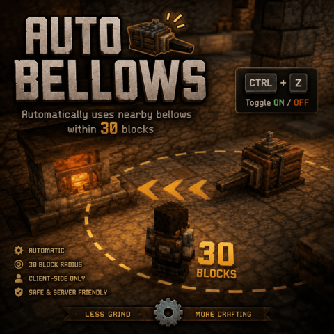

# Auto Bellows

  

  
  
  
  
  
  

---

## ✨ Features

- Automatically activates nearby bellows
- Works within a **30 block radius**
- Fully client-side
- Does not modify server logic
- Toggle anytime with **Ctrl + Z**
- Lightweight and simple

---

## ⚙️ How It Works

Once enabled, the mod scans for nearby bellows and automatically simulates normal player interaction with them.

Perfect for:
- Smelting
- Forging
- Large-scale production
- Reducing repetitive actions

---

## 🎮 Controls

| Keybind | Action |
|---|---|
| `CTRL + Z` | Enable / Disable Auto Bellows |

---

## 📌 Compatibility

- Vintage Story `1.22+`
- Client-side only

---

## 📥 Installation

1. Download the mod
2. Place the `.zip` file into your `Mods` folder
3. Launch the game

---

## ⚠️ Disclaimer

This mod is provided **"as is"** without warranty.

Not affiliated with Vintage Story developers.

---

## 📜 License

See the [LICENSE](LICENSE) file for details.

---

  Made by <b>prescko</b>

